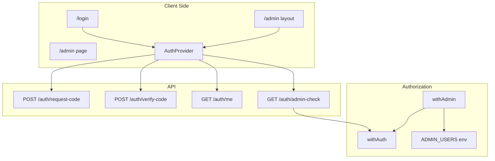

# Admin Dashboard and Authorization

## Overview

The Coworker Pilot application includes an admin dashboard and server-side admin authorization. Only users whose email is listed in the `ADMIN_USERS` environment variable can access the `/admin` route and any admin-protected API endpoints. This document covers the architecture, configuration, and developer guide for the admin implementation.

## Architecture



### Key Concepts

| Concept | Description |
|--------|-------------|
| **Admin users** | Emails listed in `ADMIN_USERS` (comma-separated). Only these users can access admin UI and admin API endpoints. |
| **Client-side check** | Auth context calls `/api/v1/auth/admin-check` to set `isAdmin` for UX (show/hide admin UI, redirect non-admins). |
| **Server-side enforcement** | Every admin API endpoint uses `withAdmin()` middleware; authorization is never trusted from the client alone. |

## Environment Configuration

### ADMIN_USERS

Admin access is controlled by a single environment variable in `coworker-pilot/.env`:

```bash
# Comma-separated list of admin email addresses (case-insensitive)
ADMIN_USERS=admin@example.com,alec.mccauley@me.com
```

- **Format:** Comma-separated email addresses.
- **Matching:** Case-insensitive; leading/trailing whitespace is trimmed.
- **Security:** Stored only on the server; never exposed to the client.
- **Empty list:** If `ADMIN_USERS` is empty or unset, no user is considered an admin.

### Example .env

```bash
# coworker-pilot/.env
DATABASE_URL="postgresql://..."
JWT_SECRET=...
JWT_REFRESH_SECRET=...

# Admin users who can access /admin and admin API endpoints
ADMIN_USERS=alec.mccauley@me.com,ops@coworker.ai
```

## Web Admin Flow

### 1. Login (`/login`)

- User enters email; API validates that a user exists and sends a 6-digit code (see [Authentication](./authentication.md)).
- User enters code; API returns access and refresh tokens.
- Tokens are stored in the browser (localStorage) and the SDK is configured with token callbacks.

### 2. Admin Check

- After successful login, the client calls `GET /api/v1/auth/admin-check` with the access token.
- The API (using `withAuth()`) verifies the JWT and checks whether the user’s email is in `ADMIN_USERS`.
- Response: `{ status: "success", data: { isAdmin: true | false } }`.
- Auth context sets `isAdmin` from this response for client-side routing and UI.

### 3. Admin Route Protection (`/admin`)

- **Not authenticated:** Redirect to `/login`.
- **Authenticated but not admin:** Show “Access Denied” with options to go home or sign out.
- **Authenticated and admin:** Render the admin dashboard.

### 4. Admin Dashboard (`/admin`)

- Displays “Welcome back, {name}” (from `/auth/me`).
- Shows current user info and a logout button.
- Placeholder cards for future admin features (users, database, settings).

## File Structure

```
coworker-pilot/
├── app/
│   ├── login/
│   │   └── page.tsx              # Login page (email + code)
│   ├── admin/
│   │   ├── layout.tsx             # Protected layout (auth + admin check)
│   │   └── page.tsx               # Admin dashboard
│   └── api/v1/auth/
│       └── admin-check/
│           └── route.ts           # GET admin-check (withAuth)
├── lib/
│   ├── admin-middleware.ts        # withAdmin(), getAdminEmails(), isAdminEmail()
│   ├── auth-context.tsx           # AuthProvider, useAuth (isAdmin)
│   └── sdk.ts                     # Browser SDK + token storage
└── components/
    └── auth/
        └── login-form.tsx         # Email/code form component
```

## API Reference

### Admin Check Endpoint

| Method | Endpoint | Auth | Description |
|--------|----------|------|-------------|
| `GET` | `/api/v1/auth/admin-check` | Required (Bearer) | Returns `{ isAdmin: boolean }` based on `ADMIN_USERS`. |

**Response (success):**

```json
{
  "status": "success",
  "data": { "isAdmin": true }
}
```

Used by the web app to set `isAdmin` in auth context after login.

## Creating Admin-Only API Endpoints

Admin-only endpoints must use `withAdmin()` so that only users in `ADMIN_USERS` can call them.

### 1. Use withAdmin() Middleware

`withAdmin()` wraps `withAuth()` and adds a check that the authenticated user’s email is in `ADMIN_USERS`. If not, the handler returns `403 Forbidden`.

```typescript
// coworker-pilot/app/api/v1/admin/some-action/route.ts
import { NextResponse } from "next/server";
import { withAdmin, AuthenticatedRequest } from "@/lib/admin-middleware";
import { successResponse } from "@/lib/api-utils";

export const dynamic = "force-dynamic";

async function handlePost(request: AuthenticatedRequest): Promise<NextResponse> {
  // request.auth is guaranteed: userId, email
  // User is guaranteed to be in ADMIN_USERS
  const { userId, email } = request.auth;

  // Admin-only logic here
  return successResponse({ done: true });
}

export const POST = withAdmin(handlePost);
```

### 2. Helper Functions

From `lib/admin-middleware.ts`:

| Function | Description |
|----------|-------------|
| `getAdminEmails()` | Returns the list of admin emails from `ADMIN_USERS`. |
| `isAdminEmail(email)` | Returns whether the given email is in the admin list. |
| `withAdmin(handler)` | Wraps a route handler to require auth + admin; returns 403 if not admin. |

Use `isAdminEmail()` when you need to check admin status inside a handler that is already protected by `withAuth()` (e.g. conditional behavior within a non-admin endpoint).

## Security Model

### Authorization vs Authentication

- **Authentication** (who you are): Handled by JWT and `withAuth()`; same as for any protected endpoint.
- **Authorization** (what you can do): For admin, handled by `withAdmin()` and `ADMIN_USERS`.

### Enforcement

- **Server:** All admin-sensitive operations must be behind routes that use `withAdmin()`. The client cannot grant itself admin access.
- **Client:** The `isAdmin` flag from `/auth/admin-check` is used only for UX (redirects, showing “Access Denied”, showing/hiding admin UI). It is not used for access control.
- **ADMIN_USERS:** Kept in server environment only; never sent to the client.

### Adding and Removing Admins

1. **Add admin:** Add the user’s email to `ADMIN_USERS` in `coworker-pilot/.env`, then restart the app (or rely on your deployment’s env reload).
2. **Remove admin:** Remove the email from `ADMIN_USERS` and restart. The user remains a valid authenticated user but will receive 403 on admin endpoints and “Access Denied” on `/admin`.

## Related Documentation

- [Authentication](./authentication.md) — Auth flow, JWT, tokens, and protected endpoints.
- [API Project](./api_project.md) — API structure, env vars, and adding endpoints.
