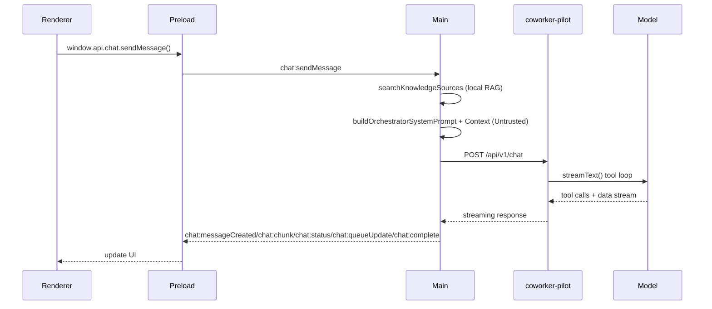

# Coworker Monorepo Technical Summary

## Purpose

This document provides a high-level technical architecture overview of the Coworker monorepo. It is intended to help new contributors understand the stack, package boundaries, and how data and contracts flow through the system.

## Monorepo Overview

Coworker is a pnpm workspace with three primary packages plus supporting tooling:

- `coworker-pilot` — Next.js 16 web app that serves the brand guide UI and the REST API.
- `coworker-app` — Electron desktop app built with Svelte 5.
- `shared-services` — Shared types, Zod schemas, Prisma client, and a type-safe SDK used by both app and API.

The architecture enforces a strict separation of concerns:

- The API owns business logic and persistence.
- The desktop app owns user experience.
- Shared services owns contracts, schemas, and SDK plumbing.

## Stack Summary

### Runtime & Tooling

- Node.js 22+ with pnpm workspaces
- TypeScript 5.x (strict)
- Zod 4.x for validation and schema-driven types

### API & Web (coworker-pilot)

- Next.js 16 App Router
- React 19
- Prisma 7 + PostgreSQL 17
- Tailwind CSS 4

### Desktop App (coworker-app)

- Electron 39
- Svelte 5 with runes
- Vite 7 + electron-vite 5
- Tailwind CSS 4
- bits-ui + tailwind-variants

### Shared Contracts (shared-services)

- Zod schemas + inferred TypeScript types
- Prisma schema and client
- Typed SDK with error classes and endpoint modules

## Package Responsibilities

### `shared-services`

Single source of truth for all shared contracts and database access.

- Types: Domain entities, API response envelopes, and CRUD primitives
- Schemas: Zod request/response validation
- SDK: Typed API client used in main process and server
- Prisma: Schema, migrations, and client

Key paths:

- `shared-services/src/types/`
- `shared-services/src/schemas/`
- `shared-services/src/sdk/`
- `shared-services/prisma/`

### `coworker-pilot`

Next.js application serving two roles:

1) Public brand guide web UI
2) Versioned REST API (`/api/v1/...`)

Responsibilities:

- API route handlers with validation and business logic
- Authentication and authorization (JWT + admin middleware)
- Consistent API response envelopes

Key paths:

- `coworker-pilot/app/api/v1/`
- `coworker-pilot/lib/` (auth, admin, JWT, responses)
- `coworker-pilot/components/` (brand guide UI)

### `coworker-app`

Electron desktop app with a three-process model:

- Main process: owns the SDK and makes all network calls
- Preload: exposes typed IPC surface
- Renderer: Svelte UI, no direct network access

Responsibilities:

- User experience and UI state
- IPC calls into the main process
- Consuming shared types and SDK contracts

Key paths:

- `coworker-app/src/main/` (IPC + SDK wiring)
- `coworker-app/src/preload/` (typed `window.api`)
- `coworker-app/src/renderer/` (Svelte UI)

## Architecture and Data Flow

### API Request Flow

1) HTTP request hits a Next.js App Router route
2) Request body validated with Zod schema from `shared-services`
3) Business logic executes (often inline in route handler)
4) Prisma client writes/reads PostgreSQL
5) Response returned via shared response helpers

### Desktop App Request Flow

1) Renderer calls `window.api.*` (IPC facade)
2) Preload forwards to main process via `ipcRenderer.invoke`
3) Main process invokes `CoworkerSdk` endpoint
4) SDK performs HTTP request against API
5) Result returns to renderer through IPC

This keeps network access and secrets out of the renderer, while preserving end-to-end type safety.

For local privileged operations that are not network calls (for example rich
clipboard writes), the same renderer -> preload -> main pattern is used so the
renderer remains unprivileged and Electron system APIs stay in main.

### AI Chat Streaming

We support a streaming chat pipeline for thread conversations:

- Renderer calls `window.api.chat.sendMessage()`.
- Main process gathers RAG context from local workspace sources, injects any @mentioned document content, injects full text for @mentioned knowledge sources (workspace/channel/thread scopes), composes the orchestrator system prompt, and streams via the SDK.
- API route `/api/v1/chat` runs a tool-orchestrated loop that selects coworkers and generates each reply via subordinate calls.
- Renderer updates coworker messages incrementally from IPC events.
- The model can emit `report_status` tool calls; the main process forwards these as `chat:status` activity updates that render in the thread header.
- If Gemini throws a tool-call `thought_signature` error while setting up orchestration, the API retries once with `report_status` disabled for that run.
- The model can emit `save_memory` tool calls; the main process persists memories and links them to coworkers for future retrieval.
- The model can invoke document editing tools (`find_document`, `read_document_range`, `edit_document`, `create_document_copy`); these are placeholder executors on the API — the main process handles them against live blob content, applying search-and-replace edits and emitting document updates.
- Document edits are versioned: each edit stores a new blob + commit message in `document_versions`, and the viewer exposes a version sidebar for preview/revert.
- User messages sent during an active orchestrator run are queued in the main process and streamed sequentially after the current run completes. The renderer receives `chat:queueUpdate` events for queued/processing states.
- Prompt injection guardrails are enforced in the main process; retrieved context is treated as untrusted and is never allowed to override system rules.
- Coworker replies use a standardized coworker system prompt block before role prompts and defaults to keep tone and behavior consistent.

#### Data Flow (RAG in Main Process)

## Type Safety and Contracts

- All request/response validation uses Zod schemas from `shared-services`.
- TypeScript types are inferred from schemas and re-exported for consumers.
- No local re-definition of shared types in the app or API.

## Authentication and Authorization

- API uses JWT-based auth with middleware wrappers.
- Admin access is enforced server-side using `withAdmin()` and `ADMIN_USERS`.
- Client-side admin checks are for UX only; server enforcement is authoritative.

## Persistence

- PostgreSQL 17 is the backing database.
- Prisma schema, migrations, and client live in `shared-services`.
- API uses the shared Prisma client via `@coworker/shared-services/db`.

## Desktop Notifications + Unread Tracking

- Renderer uses the native `Notification` API to display coworker message alerts.
- App focuses and opens the exact thread on notification click (via `window:focus` IPC).
- `threads.last_read_at` is stored in the workspace DB to track read state.
- Unread counts are computed by joining `messages` and `threads` and filtering coworker messages newer than `last_read_at`.

## Build and Workflow Notes

- Build order: `shared-services` must be built before consuming packages.
- Prisma commands run from the repo root via pnpm scripts.
- Electron builds are configured in `coworker-app/electron-builder.yml`.
- macOS builds are **universal** and include `dmg` for first-time installs plus `zip` + `latest-mac.yml` for OTA updates.
- Distribution uploads DMGs to `/downloads/` and OTA update artifacts to `/updates/`, with the public manifest at `/downloads/releases.json`.

## Quick Orientation for New Contributors

1) Start with `shared-services` when adding or modifying contracts.
2) Implement or update API routes in `coworker-pilot`.
3) Wire app functionality via IPC in `coworker-app`.
4) Keep renderer free of network logic.
5) Update docs any time behavior, architecture, or workflow changes.
