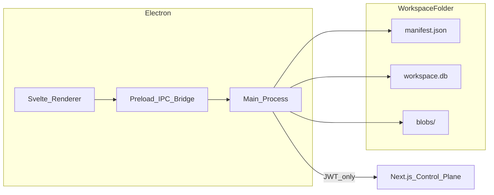
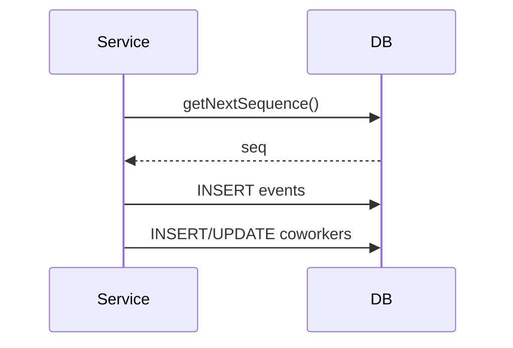
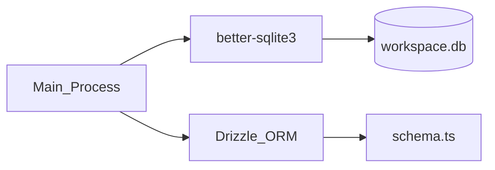

# Workspace Storage and Architecture

This document describes how data is stored in Coworker workspaces (SQLite, Drizzle, event log, projections), the workspace bundle layout, and how to work with this setup as a developer. It also records implementation status against the architecture briefing and the intended future design for blobs.

**Related docs:** [App project](app_project.md) (process model, security), [Coding standards](coding_standards.md).

---

## Table of contents

1. [Overview](#1-overview)
2. [Workspace bundle](#2-workspace-bundle)
3. [Data model](#3-data-model)
4. [SQLite and Drizzle](#4-sqlite-and-drizzle)
5. [Blobs and files](#5-blobs-and-files)
6. [Developer guide](#6-developer-guide)
7. [Implementation status](#7-implementation-status)

---

## 1. Overview

### Goals

- **Desktop-first UX:** Fast, native, resilient, offline-capable for everything except future AI inference.
- **Local-first data:** The user’s workspace is portable and lives on disk as a single folder.
- **Future-proof:** Architecture should support eventual multi-device sync without a rewrite.
- **Secure by default:** No provider keys in the Electron renderer or app bundle; secrets stay in main process or OS keychain.

### Non-goals (V1)

- Cross-device sync
- Multi-user collaboration
- Web client parity

### High-level architecture

The Electron app has a single “local backend” in the main process that owns workspace lifecycle, SQLite, event log, projections, and (future) blob storage. The cloud control plane (Next.js API) handles auth, licensing, and (future) AI proxy. The renderer never touches the database, filesystem, or secrets.

- **Renderer:** Svelte UI only; calls `window.api.workspace.*`, `window.api.coworker.*`, etc. No Node, no raw DB/FS/network.
- **Preload:** Typed IPC bridge; validates and forwards to main.
- **Main process:** Owns workspace create/open/close, SQLite (Drizzle), event append, projection updates, recent list; will own blob storage and (future) AI request proxying.
- **Workspace folder:** Single `.cowork` directory with `manifest.json`, `workspace.db`, and `blobs/`.
- **Cloud:** Auth (JWT), entitlements; future AI proxy. User data stays local.

---

## 2. Workspace bundle

Workspaces are **folders** with the extension `.cowork`, treated as a single logical “workspace” (e.g. macOS can show them as a package). They are real directories on disk. On macOS, Coworkers registers `.cowork` as a document package (`LSTypeIsPackage`) with a UTI so Finder treats it like a file and double-click opens the app.

### Folder layout

**Currently created:**

| Path | Purpose |
|------|--------|
| `manifest.json` | Workspace metadata: id, name, createdAt, schemaVersion. |
| `workspace.db` | SQLite database (WAL mode). Single file; created on workspace create. |
| `blobs/` | Directory for large/binary content. Metadata stored in `blobs` table with IPC APIs for add/read/delete. |

**Not yet created (from architecture briefing):**

- `exports/` — Optional user-readable exports (e.g. MD/YAML snapshots); not source of truth.
- `logs/` — Optional local debugging logs.
- `tmp/` — Ephemeral scratch; safe to delete.

Implementation: [workspace-manager.ts](coworker-app/src/main/workspace/workspace-manager.ts) creates the workspace root and `blobs/` in `createWorkspace()`; `manifest.json` and `workspace.db` are created there before opening the DB and running migrations.

### Manifest schema

Stored in `manifest.json` at the workspace root. Current shape:

| Field | Type | Description |
|-------|------|-------------|
| `id` | string | CUID, unique workspace id. |
| `name` | string | User-facing name (derived from folder name on create). |
| `createdAt` | string | ISO timestamp when the workspace was created. |
| `schemaVersion` | number | Used to decide which DB migrations to run on open. |

**Not yet present:** `appVersionCreatedWith` (optional; for future migration/compat).

On **open**, the main process reads `manifest.json`, validates that the path exists and contains `manifest.json` and `workspace.db`, then opens the DB and runs migrations. Migrations are keyed off SQLite `user_version`, not directly off `manifest.schemaVersion`; the manifest is the human-readable record of the workspace.

### Workspace UX

- **Create new workspace:** User chooses location/name; app creates a `.cowork` folder (e.g. `My Workspace.cowork`) with manifest, DB, and `blobs/`. Implemented via `workspace:create` and `workspace:showCreateDialog` (native save dialog).
- **Open workspace:** User picks a `.cowork` folder; app validates and opens it, runs migrations, sets it as current. Implemented via `workspace:open` and `workspace:showOpenDialog` (native open dialog; on macOS, “openFile” is allowed so the package can be selected as a file).
- **Recent workspaces:** List of recently opened workspace paths (and names) stored in app `userData`: `recent-workspaces.json`. Max 10 entries; stale or missing paths are filtered out when listing. Implemented in [recent-workspaces.ts](coworker-app/src/main/workspace/recent-workspaces.ts).

### Data portability

A workspace is **portable**: copy or move the entire `.cowork` folder. That folder is the full backup/restore unit for V1.

---

## 3. Data model

The workspace uses an **append-only event log** as the source of truth and **projection tables** for fast queries. All state changes are written as events; projections are updated from those events (today: in the same code path; future: replayable for repair).

### Event log (source of truth)

**Table:** `events`  
**Location:** [database/schema.ts](coworker-app/src/main/database/schema.ts), [database/migrations.ts](coworker-app/src/main/database/migrations.ts).

| Column | Type | Description |
|--------|------|-------------|
| `id` | TEXT PK | CUID, unique event id. |
| `workspace_id` | TEXT | Workspace id (from manifest). |
| `seq` | INTEGER | Monotonic sequence number per workspace. |
| `ts` | INTEGER | Timestamp (ms). |
| `actor` | TEXT | Who performed the action (e.g. `user`, `system`; future: `ai`, `tool`). |
| `entity_type` | TEXT | e.g. `coworker`, (future: `thread`, `message`, `tool_run`, `blob`). |
| `entity_id` | TEXT | Id of the entity affected. |
| `event_type` | TEXT | e.g. `created`, `updated`, `deleted`. |
| `payload_json` | TEXT | JSON payload of the event. |

**Indexes:** `(workspace_id, entity_type, entity_id, seq)`, `(workspace_id, seq)` for efficient replay and querying.

**Current event usage:** Coworker lifecycle only — `entity_type = 'coworker'`, `event_type` in `created`, `updated`, `deleted`. Payloads carry name/description (and optional reason for delete). No `hash` column yet (briefing suggested optional integrity hash).

### Projections (derived state)

Projections are tables that mirror “current state” and are updated when events are applied. They can be rebuilt by replaying events (repair flow not yet implemented).

**Currently implemented:**

| Table | Purpose |
|-------|---------|
| `coworkers` | Active coworker configs: id, workspace_id, name, description, created_at, updated_at, deleted_at (soft delete). Index: (workspace_id, deleted_at). |
| `channels` | Project containers: name, purpose, pinned items, sort order, archived state. |
| `threads` | Conversation sessions within channels. |
| `messages` | Thread messages, with content refs for large content and optional `reply_to_message_id` linkage for reply chains. |
| `knowledge_items` | Scoped pinned notes and summaries. |
| `knowledge_sources` | Raw inputs (text, links, files) scoped to workspace/channel/coworker/thread with optional notes, file metadata, and blob references. Drag-and-drop is supported in the app UI for file sources. Notes are indexed alongside source text for retrieval. |
| `source_text` | Extracted plain/rich text for sources, with extraction versioning and warnings. Notes are appended as labeled text for indexing and retrieval. |
| `source_chunks` | Chunked text for retrieval, indexed by FTS5 and (optional) sqlite-vec embeddings. |
| `blobs` | Blob metadata (path, mime, size, sha256) for files in `blobs/`. |

**Planned (from briefing, not yet in schema):**

- `tool_runs` — Tool invocations (id, thread_id, status, timings, error).

### Write path: append event then update projection

Today, for **coworkers**, the pattern is:

1. **Append event** — Insert one row into `events` with next `seq`, payload, entity_type/entity_id/event_type.
2. **Update projection** — Insert/update/soft-delete row in `coworkers`.

Implemented in [coworker-service.ts](coworker-app/src/main/coworker/coworker-service.ts): `getNextSequence()` reads `MAX(seq)` for the workspace; `appendEvent()` inserts the event; then the caller inserts or updates `coworkers`. **Important:** These two steps are **not** wrapped in a single SQLite transaction today. The architecture briefing recommends a single-writer pattern and atomic “append event(s) + update projections” in one transaction; that should be adopted for consistency and crash safety (documented in [Developer guide](#6-developer-guide)).

### Event types (current vs planned)

**Current:**

- Coworker: `coworker` + `created` | `updated` | `deleted`.

**Planned (briefing):**

- Workspace: e.g. `workspace.created`, `workspace.renamed`, `workspace.setting.updated`.
- Threads: `thread.created`, `thread.renamed`, `thread.archived`.
- Messages: `message.user.created`, `message.assistant.delta`, `message.assistant.completed`, `message.assistant.failed`.
- Tools: `tool.call.requested`, `tool.call.completed`, `tool.call.failed`.
- Blobs: `blob.added`, `blob.deleted`, `blob.linked`.

---

## 4. SQLite and Drizzle

### Stack

- **SQLite:** [better-sqlite3](https://github.com/JoshuaWise/better-sqlite3) (synchronous, native Node addon). Used only in the main process; packaged with the app (see `electron-builder.yml` and `electron.vite.config.ts` externals).
- **ORM:** [Drizzle ORM](https://orm.drizzle.team/) with `drizzle-orm/better-sqlite3`. Schema is defined in TypeScript in [database/schema.ts](coworker-app/src/main/database/schema.ts); migrations are custom SQL in [database/migrations.ts](coworker-app/src/main/database/migrations.ts).

### Connection and pragmas

**Open:** [database/connection.ts](coworker-app/src/main/database/connection.ts) `openDatabase(dbPath)`:

- `journal_mode = WAL` — Write-ahead logging for better concurrency and performance.
- `foreign_keys = ON` — Enforce foreign keys (no FKs in current schema; ready for future).
- `synchronous = NORMAL` — Balance of safety and write performance.

**Close:** `closeDatabase(sqlite)` runs `wal_checkpoint(TRUNCATE)` then closes the handle. Checkpointing flushes WAL into the main DB file so the workspace stays consistent when closed.

The **path** to the DB is always `{workspacePath}/workspace.db`. Only one workspace is open at a time; that single writer is the main process.

### Schema definition (Drizzle)

Tables are declared in [database/schema.ts](coworker-app/src/main/database/schema.ts) using `sqliteTable`, `text`, `integer` from `drizzle-orm/sqlite-core`. Column names use camelCase in code and map to snake_case in SQL (e.g. `workspaceId` → `workspace_id`). Types are inferred: `Event`, `NewEvent`, `Coworker`, `NewCoworker` are exported for use in services.

### Migrations

- **Versioning:** SQLite `PRAGMA user_version` stores the schema version (integer). [migrations.ts](coworker-app/src/main/database/migrations.ts) defines `CURRENT_SCHEMA_VERSION = 1` and runs pending migrations on open.
- **Execution:** `runMigrations(sqlite)` is called from workspace-manager after opening the DB (create or open). It reads `user_version`, runs any migrations with version &lt; current in a **single transaction**, then sets `user_version` to current.
- **V1 migration:** Creates `events` (with indexes) and `coworkers` (with index). Uses raw `sqlite.exec()` for DDL; no Drizzle migrate CLI.

**Adding a new migration:** Bump `CURRENT_SCHEMA_VERSION`, add a conditional (e.g. `if (currentVersion < 2) runMigrationV2(sqlite)`), implement `runMigrationV2` with `CREATE TABLE` / `CREATE INDEX` etc., and add the corresponding table to [schema.ts](coworker-app/src/main/database/schema.ts) so Drizzle types stay in sync.

### When the DB is opened/closed

- **Opened:** When a workspace is **created** or **opened** (user or recent list). One workspace at a time; previous is closed first.
- **Closed:** When the user **closes** the current workspace or the app quits. `closeWorkspace()` in workspace-manager calls `closeDatabase(currentSqlite)` and clears current workspace/db references.

---

## 5. Blobs and files

### Current state

- The **`blobs/`** directory is created when a workspace is created ([workspace-manager.ts](coworker-app/src/main/workspace/workspace-manager.ts)) and is now used for file storage.
- The `blobs` table stores blob metadata (path, mime, size, sha256), and IPC APIs `blob.add`, `blob.read`, and `blob.delete` are implemented via the main process.

### Intended design (future)

The architecture briefing specifies:

- **Location:** Large or binary content lives in the workspace folder under `blobs/`, not in the DB.
- **Content-address:** Store blobs by content hash (e.g. sha256) to deduplicate.
- **Metadata in SQLite:** A `blobs` table (e.g. id, path, mime, size, sha256, created_at) for lookup and integrity.
- **References:** Messages (or other entities) use a `content_ref` that can point to inline text, a blob id, or both, so large message bodies or tool outputs are not stored in the event payload.
- **Encryption:** Secrets stay in OS Keychain/Credential Vault, not in the workspace. Workspace-level encryption (e.g. SQLCipher or FS encryption) is deferred but the layout should stay compatible.

Blobs are implemented with a `blobs` table, SHA256 deduplication, and IPC APIs (`blob.add`, `blob.read`, `blob.delete`). File access is restricted to the workspace directory.

---

## 6. Developer guide

### How to add a new entity (e.g. “threads”)

1. **Event types:** Decide event types (e.g. `thread.created`, `thread.renamed`, `thread.archived`) and payload shapes. Use a consistent naming: `entity_type` + `event_type`.
2. **Projection table:** Add a new table in [database/schema.ts](coworker-app/src/main/database/schema.ts) (e.g. `threads`) with columns needed for queries. Export inferred types.
3. **Migration:** In [migrations.ts](coworker-app/src/main/database/migrations.ts), bump `CURRENT_SCHEMA_VERSION`, add a migration step that creates the table and indexes with raw SQL. Keep Drizzle schema and SQL in sync.
4. **Service:** In main process, add a service (e.g. `thread-service.ts`) that:
   - Gets next `seq` via a shared or per-entity helper (see `getNextSequence` in coworker-service).
   - Appends events with `entity_type`/`entity_id`/`event_type`/`payload_json`.
   - Updates the projection table (insert/update/delete). Prefer doing both in a **single transaction** (see below).
5. **IPC handlers:** Register handlers (e.g. `thread:create`, `thread:list`, `thread:getById`) that call the service and return typed results.
6. **Preload:** In [preload/index.ts](coworker-app/src/preload/index.ts), add a `thread` (or equivalent) object to `api` with methods that invoke the new IPC channels. Expose only the types the renderer needs.
7. **Renderer:** Use `window.api.thread.*` from Svelte components; no direct DB or FS access.

### Single-writer and transaction discipline

- Only the **main process** writes to the workspace DB; one workspace open at a time, so there is effectively a single writer.
- **Recommendation:** Wrap “append event(s) + update projection(s)” in a single `sqlite.transaction(() => { ... })()` so that a crash or error does not leave events without corresponding projection updates (or vice versa). Currently [coworker-service.ts](coworker-app/src/main/coworker/coworker-service.ts) does not use a transaction for this; the Drizzle API is used with the same underlying `sqlite` handle, so you can run the two steps inside a transaction callback passed to the raw `sqlite.transaction()` from the connection layer if needed.
- For **reads**, use the projection tables; avoid querying the event log for “current state” except for replay/repair.

### Testing migrations

- Create a workspace, open it (migrations run), then close and reopen with a higher `CURRENT_SCHEMA_VERSION` and a new migration. Confirm the new tables/indexes exist and `user_version` is updated.
- Optionally keep a fixture workspace at an older version to test forward-only migration paths.

### Key file reference

| Concern | File(s) |
|---------|--------|
| Workspace lifecycle | [workspace/workspace-manager.ts](coworker-app/src/main/workspace/workspace-manager.ts) |
| Recent list | [workspace/recent-workspaces.ts](coworker-app/src/main/workspace/recent-workspaces.ts) |
| DB connection | [database/connection.ts](coworker-app/src/main/database/connection.ts) |
| Schema (Drizzle) | [database/schema.ts](coworker-app/src/main/database/schema.ts) |
| Migrations | [database/migrations.ts](coworker-app/src/main/database/migrations.ts) |
| Event + projection example | [coworker/coworker-service.ts](coworker-app/src/main/coworker/coworker-service.ts) |
| Workspace IPC | [workspace/ipc-handlers.ts](coworker-app/src/main/workspace/ipc-handlers.ts) |
| Coworker IPC | [coworker/ipc-handlers.ts](coworker-app/src/main/coworker/ipc-handlers.ts) |
| Preload API | [preload/index.ts](coworker-app/src/preload/index.ts) |

---

## 7. Implementation status

Status of the architecture briefing items (V1 workspace + storage). AI/streaming/tool-calling are out of scope and not listed.

| Briefing item | Status | Notes |
|---------------|--------|--------|
| Workspace create/open/close | Done | workspace-manager, native dialogs, recent list |
| Folder: manifest.json, workspace.db, blobs/ | Done | exports/, logs/, tmp/ not created |
| manifest.schemaVersion | Done | Validated on open; migrations run |
| manifest.appVersionCreatedWith | Not done | — |
| SQLite WAL, transactions | Done | WAL + checkpoint on close; single writer (one open workspace) |
| Event append + projection | Done | All entities use atomic transactions now |
| Coworker extended fields | Done | rolePrompt, defaultsJson, templateId, templateVersion, templateDescription |
| Channels table + service | Done | channel-service.ts with create, update, archive, list, createDefaults |
| Threads table + service | Done | thread-service.ts with create, update, archive, list by channel |
| Messages table + service | Done | message-service.ts with create, update, list by thread, and persisted reply links (`reply_to_message_id`) |
| Knowledge items table + service | Done | Scoped to workspace/channel/coworker, pinning support |
| Knowledge sources table + service | Done | text/file/url sources with scope + notes, stored as blobs |
| Source extraction + indexing | Done | source_text + source_chunks tables, FTS5 + sqlite-vec indexing |
| Blobs table + service | Done | SHA256 deduplication, add/read/delete APIs |
| Templates from cloud | Done | Fetched when create co-worker dialog opens (no cache) |
| Sidebar navigation UI | Done | Channels and coworkers in left rail |
| Channel/Thread UI | Done | Thread list, message view, input composer, context panel |
| IPC for all entities | Done | workspace.*, coworker.*, channel.*, thread.*, message.*, knowledge.*, blob.*, templates.* |
| Repair / integrity_check / rebuild projections | Not done | — |

Summary: All core entity tables and services are in place. Event sourcing uses atomic transactions for crash safety. Cloud template system with admin UI; app fetches templates from the API when the create co-worker dialog opens (no local cache). UI includes sidebar navigation, channel views, and placeholders for conversation UI. Pending: manifest `appVersionCreatedWith`, optional folders (exports/, logs/, tmp/), and repair/rebuild flows.
